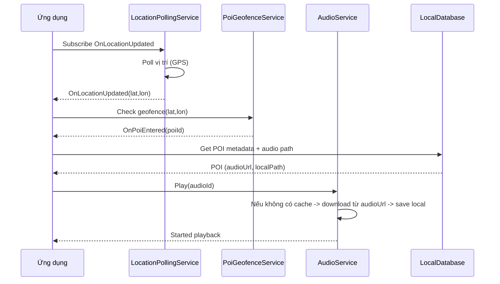

# PRD — TravelApp

Phiên bản: 1.0
Ngày: [Ghi ngày nộp]
Người soạn: Nhóm đồ án

---

Mục tiêu: Tài liệu Product Requirements (PRD) trình bày rõ ràng, dễ hiểu để nộp cho giáo viên. Bao gồm sơ đồ kiến trúc, sequence diagram, mockup UI đơn giản và hướng dẫn xuất file.

Mô tả ngắn
- TravelApp là ứng dụng mobile (MAUI, .NET 10) dùng để hướng dẫn tham quan các điểm (POI) dựa trên vị trí người dùng. Hỗ trợ geofencing, audio guide, hoạt động offline-first và đồng bộ nền khi có mạng.

1. Mục tiêu chính
- Tự động phát audio khi người dùng đến gần POI (geofence).
- Hỗ trợ tải và cache audio để nghe offline.
- Ứng dụng hoạt động offline-first, ưu tiên dữ liệu local (SQLite).
- Thiết kế theo Clean Architecture, services interface-based, DI.

2. Stakeholders
- Giáo viên/chấm đồ án
- Người dùng cuối (khách du lịch)
- Nhóm phát triển (frontend MAUI, backend API)

3. Personas (ví dụ)
- Khách du lịch trẻ (25–40): cần hướng dẫn nhanh bằng audio.
- Người cao tuổi: cần UI to, dễ đọc, tính năng offline.
- Hướng dẫn viên: muốn kiểm tra trạng thái POI và audio cache.

4. Phạm vi (Scope)
In-scope:
- Bản đồ (Map) hiển thị POI, danh sách POI
- LocationPollingService: lấy vị trí, phát sự kiện OnLocationUpdated
- PoiGeofenceService: quản lý geofence, phát OnPoiEntered/Exited
- AudioService: tải, cache và phát audio
- LocalDatabaseService (SQLite) và PoiApiService (sync)

Out-of-scope: thanh toán, mạng xã hội, chia sẻ realtime giữa người dùng

5. Yêu cầu chức năng (Functional Requirements)
- F1: Hiển thị danh sách POI (ảnh, mô tả, khoảng cách)
- F2: Map view với marker, focus POI
- F3: Polling vị trí, phát event OnLocationUpdated
- F4: Geofencing (enter/exit), cấu hình bán kính
- F5: Audio guide (auto-play khi vào vùng, control playback, cache)
- F6: Offline-first (luôn load từ local DB trước)
- F7: Cài đặt: bật/tắt auto-play, cấu hình geofence radius

6. Yêu cầu phi chức năng (Non-functional)
- N1: Tiết kiệm pin (debounce vị trí, threshold khoảng cách)
- N2: Độ trễ phát audio ≤ 3s sau khi trigge
- N3: Bảo mật: HTTPS, không lưu token plain text
- N4: Accessibility: font scalable, contrast, hỗ trợ screen reader

7. Kiến trúc tổng quan
- Pattern: Clean Architecture
- Lớp Presentation: Views (XAML), ViewModels (chỉ bind + expose commands)
- Lớp Services: LocationPollingService, PoiGeofenceService, AudioService, PoiApiService, LocalDatabaseService
- Lưu ý: Business logic không được đặt trong ViewModel (theo .github/copilot-instructions.md)

Mermaid component diagram (kiến trúc):

```mermaid
flowchart LR
  A[UI (MAUI Views)] -->|binds| B[ViewModels]
  B -->|subscribe| C[LocationPollingService]
  B -->|subscribe| D[PoiGeofenceService]
  B -->|call via service| E[AudioService]
  C --> F[Native Location API]
  D -->|uses| C
  E --> G[Local File Storage (audio cache)]
  H[Remote API] -->|sync| I[LocalDatabase (SQLite)]
  E --> I
  B --> I
```

8. Sequence diagram — khi người dùng đi vào geofence



9. Mô tả dữ liệu & API
- Bảng POI (SQLite): id, title, description, lat, lon, radius, audioUrl, localAudioPath, lastUpdated
- API endpoints (ví dụ):
  - GET /api/pois
  - GET /api/pois/{id}/audio
  - POST /api/sync-status

10. UI mockup (mô tả + ASCII)
- Trang chính: Map full-screen + bottom sheet chứa danh sách POI

ASCII mockup:

+------------------------------------------+
| Header: TravelApp  [Offline indicator]   |
+------------------------------------------+
|                   Map                    |
|                (Marker, POI)             |
|                                          |
+------------------------------------------+
| Bottom sheet:                            |
|  - POI card: [img] Title - dist - Play   |
|  - POI card: ...                         |
+------------------------------------------+

11. Acceptance criteria (AC)
- AC1: Ứng dụng load POI từ local khi offline
- AC2: Khi vào geofence và auto-play ON -> audio tự phát
- AC3: Audio được cache và phát offline
- AC4: ViewModels không chứa geolocation/http/audio logic

12. Milestones (gợi ý)
- M1: Thiết kế data model & API (Tuần 1)
- M2: Local DB + POI list + Map (Tuần 2)
- M3: LocationPolling + Geofence (Tuần 3)
- M4: AudioService + Sync (Tuần 4)
- M5: Testing & polishing (Tuần 5)

13. Deliverables để nộp
- Mã nguồn (repo) + README build/run
- APK/IPA hoặc hướng dẫn build MAUI
- PRD (file này)
- Sơ đồ kiến trúc & sequence (đã chèn ở trên)
- Video demo ngắn

14. Hướng dẫn xuất file (PDF/Word) và chèn hình thực tế
- Cách xuất Markdown sang PDF (PowerShell):
  - Dùng pandoc (nếu đã cài): pandoc docs/PRD_TravelApp.md -o PRD_TravelApp.pdf
  - Hoặc mở file .md trong VS Code và dùng extension Markdown PDF
- Để chèn hình thực tế: thêm file ảnh vào docs/images/, sau đó tham chiếu trong markdown: ``
- Nếu cần ảnh PNG từ mermaid: dùng mermaid-cli để xuất:
  - npm i -g @mermaid-js/mermaid-cli
  - mmdc -i diagram.mmd -o diagram.png
  - hoặc chuyển block mermaid trong file sang file .mmd rồi export

15. Gợi ý nộp bài (tối ưu cho giáo viên)
- Nén repo (không chứa bin/obj) + kèm PRD.pdf
- Đính kèm video demo <3 phút mô tả 3 tính năng chính
- Ghi rõ hướng dẫn chạy (emulator/devices) trong README

---

Phụ lục: Một số command hữu ích
- Build MAUI release (Windows): dotnet build -c Release
- Xuất PDF từ Markdown: pandoc docs/PRD_TravelApp.md -o docs/PRD_TravelApp.pdf

Chúc bạn nộp đạt điểm cao! Nếu muốn mình xuất thành Word/PDF và tạo các ảnh PNG từ mermaid cho chèn trực tiếp, mình có thể tạo thêm các file .mmd và hướng dẫn export.
